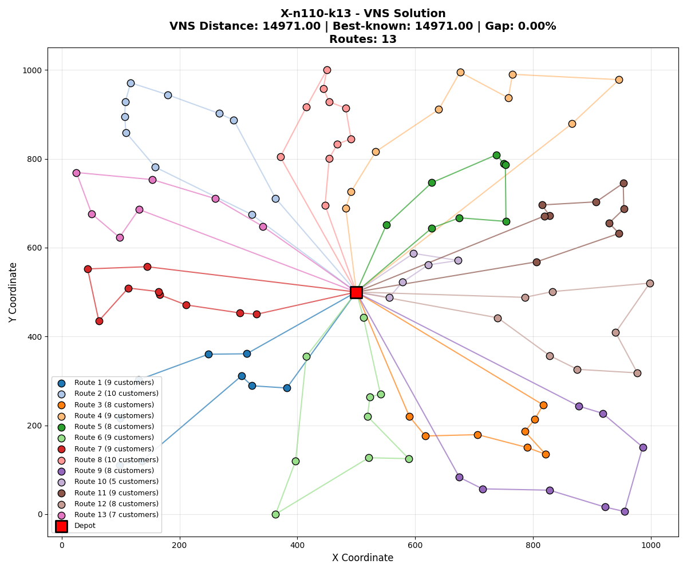
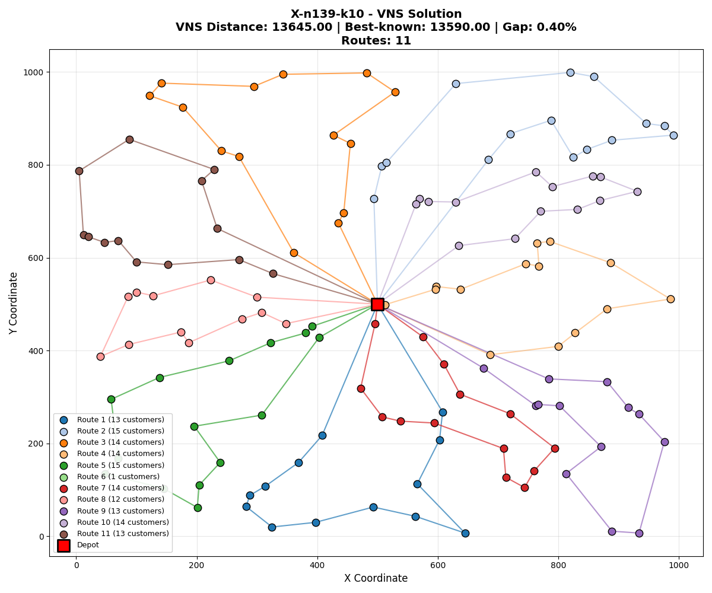
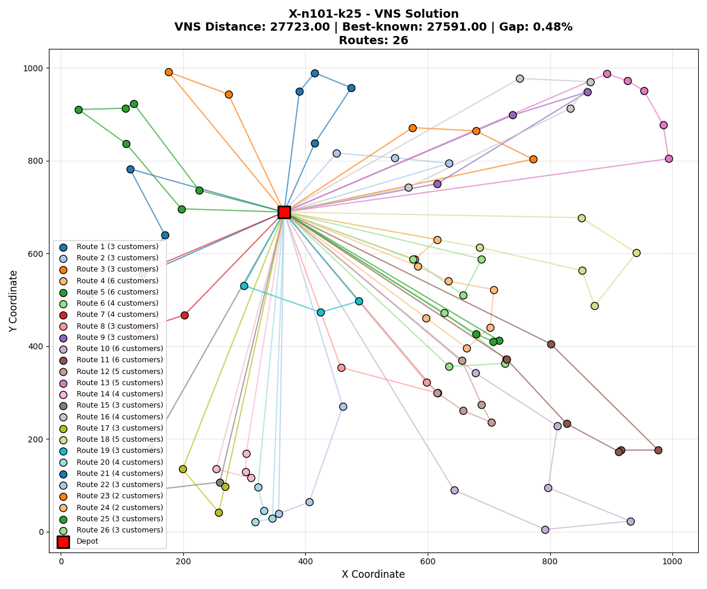
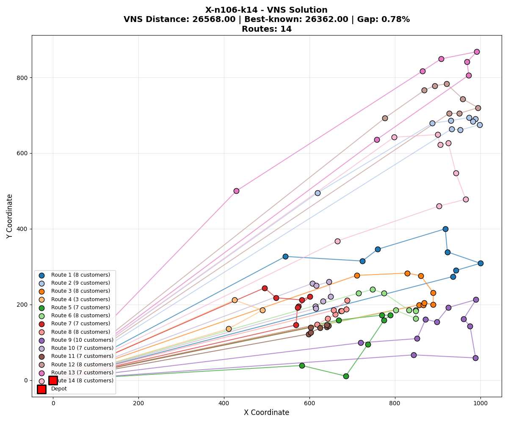

# CVRP Solver using Variable Neighborhood Search (VNS)


Ένα υψηλής απόδοσης σύστημα επίλυσης του προβλήματος **Capacitated Vehicle Routing Problem (CVRP)**, υλοποιημένο σε Python. Το έργο χρησιμοποιεί τον μετα-ευρετικό αλγόριθμο **Variable Neighborhood Search (VNS)** ενισχυμένο με στρατηγικές **Ruin & Recreate** και **Delta Evaluation** για την επίτευξη αποτελεσμάτων με απόκλιση **< 0.5%** από τις βέλτιστες γνωστές λύσεις.

---

##  Σύνοψη Αποτελεσμάτων

Ο αλγόριθμος δοκιμάστηκε σε instances της βιβλιοθήκης **VRPLIB** (X-Set). Τα αποτελέσματα δείχνουν εξαιρετική σύγκλιση προς τις βέλτιστες γνωστές λύσεις (BKS).

| Instance | VNS Cost | BKS Cost | Gap (%) | Οχήματα (VNS) |
| :--- | :---: | :---: | :---: | :---: |
| **X-n110-k13** | **14,971.00** | 14,971 | **0.00% (Optimal)** | 13 |
| **X-n139-k10** | 13,645.00 | 13,590 | **0.40%** | 11 |
| **X-n101-k25** | 27,723.00 | 27,591 | **0.48%** | 26 |
| **X-n106-k14** | 26,568.00 | 26,362 | **0.78%** | 14 |

> **Μέσος Όρος Gap:** **0.41%**

---

##  Visualizations

Ακολουθούν τα διαγράμματα των τελικών λύσεων για τα 4 instances που εξετάστηκαν.

### 1. Instance: X-n110-k13 (Optimal Solution)
> **Cost:** 14,971 | **Gap:** 0.00%


### 2. Instance: X-n139-k10
> **Cost:** 13,645 | **Gap:** 0.40%


### 3. Instance: X-n101-k25
> **Cost:** 27,723 | **Gap:** 0.48%


### 4. Instance: X-n106-k14
> **Cost:** 26,568 | **Gap:** 0.78%


---

##  Το Πρόβλημα (CVRP)

To **Capacitated Vehicle Routing Problem** είναι ένα κλασικό πρόβλημα συνδυαστικής βελτιστοποίησης (NP-hard). Στόχος είναι η εύρεση των βέλτιστων διαδρομών για έναν στόλο οχημάτων που εδρεύει σε μια κεντρική αποθήκη (depot), ώστε να εξυπηρετηθεί ένα σύνολο πελατών.

**Περιορισμοί:**
1. Κάθε όχημα έχει συγκεκριμένη χωρητικότητα (Capacity).
2. Κάθε πελάτης πρέπει να εξυπηρετηθεί ακριβώς μία φορά.
3. Όλες οι διαδρομές ξεκινούν και καταλήγουν στο depot.

---

##  Αλγόριθμος & Μεθοδολογία

Η υλοποίηση βασίζεται στη μεθοδολογία **General Variable Neighborhood Search (GVNS)**.

### 1. Initial Solution
Δημιουργία αρχικής λύσης με τον ευρετικό αλγόριθμο **Nearest Neighbor** (με ελέγχους εγκυρότητας χωρητικότητας).

### 2. Local Search (VND Strategy)
Εφαρμογή **Variable Neighborhood Descent** με πολλαπλούς τελεστές γειτονιάς:
*   **Intra-Route 2-opt:** Αντιστροφή τμημάτων διαδρομής (διόρθωση διασταυρώσεων).
*   **Inter-Route 2-opt* (Star):** Ανταλλαγή "ουρών" μεταξύ διαδρομών (βελτιστοποίηση κατανομής φορτίου).
*   **Relocate / Or-opt (k=1, 2, 3):** Μετακίνηση μεμονωμένων πελατών ή αλυσίδων πελατών σε άλλες διαδρομές.
*   **Swap:** Αμοιβαία ανταλλαγή πελατών μεταξύ οχημάτων.

### 3. Shaking (Ruin & Recreate)
Για την έξοδο από τα τοπικά βέλτιστα (Local Optima), αντί για τυχαίες κινήσεις, χρησιμοποιείται η στρατηγική **LNS (Large Neighborhood Search)**:
*   **Ruin:** Στοχευμένη ή τυχαία αφαίρεση σημαντικού ποσοστού πελατών.
*   **Recreate:** Επαναδημιουργία λύσης με χρήση **Best Insertion Heuristic** (Greedy).

---

##  Χαρακτηριστικά & Βελτιστοποιήσεις

*    **Delta Evaluation O(1):** Όλοι οι υπολογισμοί κόστους στο Local Search γίνονται αυξητικά (incremental updates). Ο αλγόριθμος δεν υπολογίζει ξανά όλη τη διαδρομή, αλλά μόνο τη διαφορά κόστους των ακμών που αλλάζουν.
*    **Adaptive Shaking:** Το ποσοστό "καταστροφής" (ruin rate) προσαρμόζεται δυναμικά ανάλογα με το αν ο αλγόριθμος έχει κολλήσει σε στάσιμο σημείο.
*    **Visualization:** Αυτόματη παραγωγή γραφημάτων επαγγελματικού επιπέδου με `matplotlib`.
*    **Robustness:** Πλήρης διαχείριση σφαλμάτων (validations) στα δεδομένα εισόδου και διόρθωση σφαλμάτων στρογγυλοποίησης (floating point drift).

---

##  Δομή Project

```text
CVRP-Solver/
├── main.py               # Κεντρικό script εκτέλεσης (CLI)
├── vns_solver.py         # Κώδικας αλγορίθμου (VNS logic, Operators, Delta Eval)
├── CVRP_Instance.py      # Parser & Data Validator για .vrp αρχεία
├── initial_solution.py   # Κατασκευαστικός αλγόριθμος (Nearest Neighbor)
├── visualization.py            # Σύστημα Visualization
├── requirements.txt      # Dependencies (matplotlib)
├── visualizations/       # Φάκελος διαγραμμάτων
└── Instances/            # Φάκελος δεδομένων
    ├── cvrp_tests/       # Τα 4 benchmarks που αναλύθηκαν
    └── cvrp/             # 100 επιπλέον instances


